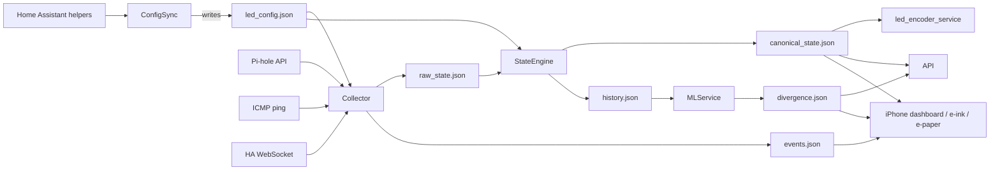

# Rehoboam Rack

Rehoboam Rack is a modern status wall for a compact home lab: a Jetson-powered backplane drives a 16-LED panel, a mirror-mounted iPhone dashboard, and e-ink scenes so you can see rack health at a glance. This repo contains the full stack—Jetson services, Teensy encoder, dashboards, ML scoring, and dev tooling.

**Physical Setup:** The Jetson Nano/SSD/Teensy live in a 10" rack behind the TV. Two Neopixel strips form a 16-dot panel on the wall, an iPhone sits behind a two-way mirror (running the dashboard), and an IT8951 e-paper display can cycle through richer scenes (activity log, divergence, etc.).

**Documentation:** Key design docs live in [`docs/ARCHITECTURE.md`](docs/ARCHITECTURE.md) and [`docs/SERVICES_AND_AGENTS.md`](docs/SERVICES_AND_AGENTS.md). This README summarizes the operational view.

---

## Quick Start

Get up and running quickly:

```bash
# Clone the repository
git clone https://github.com/griffingilreath/rehoboam.git
cd rehoboam

# Set up Python environment
python -m venv .venv && source .venv/bin/activate

# Install dependencies (core + dev helpers)
pip install -r jetson/requirements.txt
pip install -r requirements-dev.txt

# Interactive setup wizard (HA base URL, tokens, Pi-hole, configs)
# The wizard shows existing config and allows selective configuration
python devtools/setup_wizard.py

# Optional: seed data directory for local testing
mkdir -p data && cp samples/led_config.sample.json data/led_config.json
```

**Next Steps:**
- Run services locally: `python jetson/*/main.py --once` to test individual services
- Enable systemd units: See [Running the System](#running-the-system) section below
- Test LED panel: `python devtools/test_led_panel.py --quick`
- View dev dashboard: `python -m http.server 8000` then visit `http://localhost:8000/devtools/dashboard/`
- Preview the generative e-ink visualizer: `python -m visualizers.generative_eink.examples.pi_weight_demo --backend fake` (see [`docs/generative_eink_quickstart.md`](docs/generative_eink_quickstart.md))

---

## System Overview

The Rehoboam system follows a pipeline architecture where services read and write shared JSON artifacts:

```
Home Assistant + Pi-hole -> config_sync_service -> led_config.json
                               |
collector_service -> raw_state.json -> state_engine_service -> canonical_state.json
                                                            |-> history.json -> ml_service -> divergence.json
                                                            |-> led_encoder_service -> Teensy
                                                            |-> api_service -> dashboards/e-ink
```

**Shared Data Directory:** All runtime artifacts live under `./data/`:
- `led_config.json` - LED slot configuration (from Home Assistant)
- `raw_state.json` - Raw telemetry (ping, Pi-hole stats, HA events)
- `canonical_state.json` - Processed LED states (health, activity levels)
- `history.json` - Time-series record of all canonical snapshots
- `divergence.json` - ML anomaly scores and recommendations
- `service_health.json` - Service heartbeat status
- `events.json` - Normalized Home Assistant events

---

## How It Works

Understanding the data flow and service responsibilities:

| Phase | Responsible Service(s) | Inputs | Output Artifact | Notes |
| ----- | ---------------------- | ------ | ----------------| ----- |
| 1. Configuration | `config_sync_service` | Home Assistant helper entities (`input_text.*`, `input_select.*`) | `data/led_config.json` | Cursor-friendly JSON describing each LED slot (name, IP, HA availability entity, event entities, type). |
| 2. Telemetry & Events | `collector_service` | `led_config.json`, ICMP ping, Pi-hole HTTP API, Home Assistant WebSocket/MQTT | `data/raw_state.json`, `data/events.json` | Each poll window records reachability, latency, HA availability, Pi-hole stats, plus a normalized stream of Home Assistant events for downstream visualizations. |
| 3. Canonical State | `state_engine_service` | `led_config.json`, `raw_state.json` | `data/canonical_state.json`, `data/history.json` | Health rules (`OK/WARNING/ERROR/OFFLINE`) and activity levels (`0.0–1.0`) are computed per LED. Each snapshot carries contextual info (daypart, weather/occupancy flags) pulled from HA and is appended to history for ML, displays, and dashboards. |
| 4. Divergence / Analytics | `ml_service` | `history.json` | `data/divergence.json` (contains `recommendations` array) | A simple z-score model compares the latest activity against rolling baselines and emits a score + level (`normal`, `caution`, `divergent`). The same artifact carries early “recommendations” (e.g., close blinds before rain) as a bridge to future predictive models. |
| 5. Distribution | `led_encoder_service`, `api_service`, `display_clients/*`, `epaper/` | `canonical_state.json`, `divergence.json`, `events.json`, `history.json` | Teensy LED frames (`{i,h,a,t}`), REST API responses (`/status`, `/config`, `/history`, `/health`, `/divergence`), iPhone dashboard, e-ink/e-paper scenes. |

**Why this architecture?**

- **Debuggable:** Shared JSON artifacts mean you can open any file under `data/` and immediately see what each service produced
- **Resilient:** Every step is idempotent—services reread inputs each loop and rewrite outputs atomically, so crashes don't corrupt downstream consumers
- **Observable:** Heartbeats (`service_health.json`) ensure the API and dashboards always know which agents are healthy
- **Familiar pattern:** Mirrors well-known home automation stacks (e.g., [Home Assistant + ESPHome](https://www.home-assistant.io/), [Pi-hole dashboards](https://github.com/pi-hole/AdminLTE)) where helpers define config, collectors gather telemetry, and renderers subscribe to a canonical feed

### Step-by-Step Data Flow

1. **Configuration authoring:**  
   Home Assistant helpers (input_text/input_select) → `config_sync_service` → `data/led_config.json`

2. **Telemetry & events:**  
   `config_sync_service` output + Pi-hole API + ping + HA WebSocket → `collector_service` → `data/raw_state.json` + `data/events.json`

3. **State derivation:**  
   `state_engine_service` reads `led_config.json` + `raw_state.json`, applies health/activity rules → `data/canonical_state.json` and appends to `data/history.json`

4. **Analytics:**  
   `ml_service` consumes `history.json`, computes divergence → `data/divergence.json`

5. **Distribution:**  
   - `led_encoder_service` converts `canonical_state.json` into `{i,h,a,t}` frames → Teensy/LED panel  
   - `api_service` serves `/status`, `/config`, `/history`, `/health`, `/divergence`  
   - Dashboards/e-paper scenes pull from `canonical_state.json`, `divergence.json`, `events.json`



**Debugging Tip:** Inspect artifacts in this order: `led_config.json` → `raw_state.json` → `canonical_state.json` → `divergence.json`. Each service README describes the exact schema.

### Real-World Examples

**Example 1: Turning on a lamp**
- Home Assistant logs the action
- The collector sees the event and pings the lamp's bridge
- The state engine marks the lamp LED as healthy/active
- Every UI (LED panel, dashboard, e-ink) updates within a second
- If pings fail, the LED goes red and `/status` reflects the failure

**Example 2: DNS traffic spike**
- Pi-hole reports QPS and block ratio
- When traffic jumps, the state engine keeps the Pi-hole LED pulsing faster
- The divergence score climbs as activity exceeds baseline
- Dashboards and e-paper scenes show "Pi-hole traffic high, blocked 32%"

**Example 3: Automation triggers a blind**
- HA sends a `state_changed` event
- The collector records "Blind → 50% (Sunrise automation)"
- The activity log scene lists it
- The LED briefly animates to show motion

**Key Insight:** All displays, dashboards, and scripts read the same JSON files, so anyone can understand or debug what's happening without digging into the code.

---

## Setup & Configuration

### Prerequisites

- Jetson Nano (or any Linux host) with Python 3.9+
- [Home Assistant](https://www.home-assistant.io/) + MQTT (for helper entities and events)
- [Pi-hole](https://github.com/pi-hole/AdminLTE#http-api) HTTP API access
- Teensy (Arduino) connected via USB for the LED panel
- Optional: e-ink panel hardware, iPhone kiosk device

**Install dependencies:**
```bash
python -m venv .venv && source .venv/bin/activate
pip install -r jetson/requirements.txt
pip install -r requirements-dev.txt  # includes ruff/mypy for CI parity
```

Service-specific dependencies are documented in each directory (e.g., `display_clients/eink_client/requirements.txt`).

### Setup Wizard

The interactive setup wizard (`python devtools/setup_wizard.py`) provides a menu-driven interface for configuring all Rehoboam services.

**Features:**
- **Interactive menu:** Select what to configure (HA, Pi-hole, API, LED encoder, e-paper)
- **Configuration summary:** View current settings at any time (option 6)
- **Smart defaults:** Shows existing values - press Enter to keep them
- **Selective updates:** Configure only what you need, skip the rest
- **Status indicators:** Menu shows ✓/✗ for each configured section
- **Full setup option:** Option 7 to configure everything in one pass

**Usage:**
```bash
python devtools/setup_wizard.py
```

**Menu Options:**
1. Home Assistant settings (URL, token)
2. Pi-hole settings (URL, token, enable/disable)
3. API & Dashboard settings (port, CORS origins)
4. LED Encoder / Teensy settings (serial device, optional LED test)
5. E-paper display settings (backend: fake/spi/usb)
6. View current configuration summary
7. Run full setup (configure everything)
0. Exit

The wizard automatically loads existing configuration from `.env` and `config.yaml` files, so you can easily update just what you need without re-entering everything.

### Configuration & Data Directory

1. **Create a writable data directory** (default `./data`)
2. **Copy service configs:** Each service's `config.example.yaml` → `config.yaml` and edit:
   - Home Assistant URLs/tokens
   - Serial device path and baud rate
   - API host/port, CORS origins
   - ML/History retention thresholds
3. **Shared data directory:** Ensure `data/` is shared by all services so files like `led_config.json`, `raw_state.json`, `canonical_state.json`, `history.json`, `divergence.json`, and `service_health.json` stay in sync

> **Important:** The `data/` directory in this repo is a runtime scratch space. Only `.gitkeep` lives there in git—do not commit real JSON artifacts or `config.yaml` files (they contain tokens). Keep production configs in `/etc/rehoboam` or another untracked location.

### Repository Layout

| Path | Purpose |
| --- | --- |
| `jetson/config_sync_service/` | Pull LED metadata from Home Assistant helpers |
| `jetson/collector_service/` | Ping devices, gather Pi-hole stats, listen to HA events |
| `jetson/state_engine_service/` | Convert raw metrics into canonical per-LED state + history |
| `jetson/led_encoder_service/` | Stream compact frames over serial to the Teensy |
| `jetson/api_service/` | FastAPI server exposing `/status`, `/config`, `/history`, `/health`, `/info` |
| `jetson/ml_service/` | Simple divergence scorer (z-score baseline) that writes `divergence.json` |
| `jetson/common/` | Shared utilities (heartbeat tracker, enums, service runner, etc.) |
| `display_clients/iphone_dashboard/` | Static PWA dashboard for iPhone behind the two-way mirror |
| `display_clients/eink_client/` | Script that renders grayscale PNGs for e-ink panels |
| `epaper/` | Modular e-paper scene runner (CLI + config-driven service) |
| `firmware/teensy_led_panel/` | Teensy + PlatformIO firmware for the 16-LED Neopixel panel |
| `third_party/it8951/` | Waveshare + GregDMeyer IT8951 repos/submodules and build artifacts |
| `third_party/teensy_examples/` | Stock PJRC/FastLED reference sketches |
| `docs/schemas/` | JSON Schemas for every shared artifact |
| `samples/` | Minimal sample JSON payloads that match the schemas |
| `docs/api/openapi.json` | Frozen FastAPI schema generated from the live service |
| `docs/home_assistant_helpers.example.yaml` | Complete Home Assistant helper configuration example |
| `devtools/dashboard/` | Local-only web UI for inspecting status/divergence/events |
| `devtools/setup_wizard.py` | Interactive menu-based setup wizard |
| `devtools/test_led_panel.py` | LED panel test & calibration tool |

> **Naming note:** The `jetson/` directory contains the backend services, but they run on any Linux host (the Jetson Nano just happens to be the first target).

---

## Running the System

### Local Development (Mac/PC)

```bash
python -m venv .venv && source .venv/bin/activate
pip install -r jetson/requirements.txt
cp jetson/*/config.example.yaml jetson/*/config.yaml   # edit tokens locally
python jetson/api_service/main.py --config jetson/api_service/config.yaml --log-level DEBUG
python -m http.server 8000   # serve dev dashboard
# in another shell:
curl http://localhost:8000/devtools/dashboard/  # open in browser/iPhone

# Export HA helpers config for easy setup
python devtools/cli.py export-ha-config --output helpers.yaml
```

Keep configs + runtime JSON in `data/` while testing, but **never commit** them (they're gitignored). Use the CLI helper (`python devtools/cli.py`) to inspect state over SSH.

### Rack Deployment (Jetson Nano)

```bash
sudo mkdir -p /etc/rehoboam && sudo chown jetson:jetson /etc/rehoboam
cp jetson/*/config.example.yaml /etc/rehoboam/<service>.yaml   # edit with real tokens/IPs

# optional: centralize secrets (read automatically if present)
sudo tee /etc/rehoboam/secrets.env <<'ENV'
# Home Assistant
HA_BASE_URL=http://homeassistant.local:8123
HA_TOKEN=REPLACE_ME
# Pi-hole
PIHOLE_BASE_URL=http://pihole.local
PIHOLE_TOKEN=REPLACE_ME
ENV

# create env file for systemd units
sudo tee /etc/rehoboam.env <<'ENV'
REHOBOAM_HOME=/opt/rehoboam
REHOBOAM_VENV=/opt/rehoboam/.venv
REHOBOAM_DATA=/opt/rehoboam/data
ENV

cd /opt/rehoboam && python -m venv .venv && source .venv/bin/activate
pip install -r jetson/requirements.txt

sudo cp systemd/rehoboam-*.service /etc/systemd/system/
sudo systemctl daemon-reload
sudo systemctl enable --now rehoboam-config-sync.service rehoboam-collector.service \
  rehoboam-state-engine.service rehoboam-led-encoder.service rehoboam-api.service \
  rehoboam-ml.service rehoboam-epaper.service
```

Secrets (Home Assistant and Pi-hole tokens) live only in `/etc/rehoboam/*.yaml`; never commit real config files.

> **E-paper shutdown:** `rehoboam-epaper.service` calls `python -m epaper.service.main ... --shutdown` in `ExecStop` so the IT8951 panel always receives a clean refresh + sleep before power loss. If you create custom units, keep that shutdown step or you risk permanent ghosting on the glass.

### Running Core Services

Typical order (each in its own process/systemd unit):

```bash
python jetson/config_sync_service/main.py --config jetson/config_sync_service/config.yaml
python jetson/collector_service/main.py --config jetson/collector_service/config.yaml
python jetson/state_engine_service/main.py --config jetson/state_engine_service/config.yaml
python jetson/led_encoder_service/main.py --config jetson/led_encoder_service/config.yaml
python jetson/api_service/main.py --config jetson/api_service/config.yaml
python jetson/ml_service/main.py --config jetson/ml_service/config.yaml  # optional but enables divergence visuals
```

All services write heartbeats into `data/service_health.json`. The API reads that file for `/health`, so as long as every process points at the same `data_dir`, the dashboard can show live service status.

### systemd Templates

Sample units live in [`systemd/`](systemd/README.md). After creating `/etc/rehoboam.env` with the appropriate paths (`REHOBOAM_HOME`, `REHOBOAM_VENV`, `REHOBOAM_DATA`), copy the `.service` files into `/etc/systemd/system/`, run `sudo systemctl daemon-reload`, and `enable --now` whichever agents you need. This keeps the stack resilient across reboots and ensures `service_health.json` stays fresh.

---

## Hardware & Integration

### LED Panel & Home Assistant

**Physical Layout:**
- The 16 LEDs are split into two banks to mirror the rack
- `R1–R8` (indices `0–7`) cover the rack's front row (Ethernet in, Jetson/Teensy controller, Pi-hole, NAS, Mac mini, Wi-Fi, uplink)
- `S1–S8` (indices `8–15`) cover the smart-home shelf (Hue, Lutron, Ikea, Aqara, Starling, Home Assistant core, Eufy, switch uplink)
- The Teensy firmware simply reads the `index` it receives (`{i,h,a,t}` frames), so you can reshuffle the hardware by editing helper values with zero firmware changes

**Home Assistant Helpers:**
- Every slot has five helpers (`name`, `ip`, `type`, `ha_availability_entity`, `event_entities`)
- The "Rack Config" Lovelace page (grid view) keeps them organized so you can tap-to-edit from a phone
- Sample YAML for helpers, grid layout, and validation automations lives in [`docs/home_assistant.md`](docs/home_assistant.md)
- See [`docs/home_assistant_helpers.example.yaml`](docs/home_assistant_helpers.example.yaml) for a complete, ready-to-use configuration example

**Quick Tweaks:**
- Change a helper, wait for `config_sync_service` (polls every 30s) to regenerate `led_config.json`
- The collector/state engine/LED encoder will all pivot to the new device automatically

**Bidirectional HA View:**
- Optional `rest` sensors can read `/status` and `/divergence` so the Rack Config page also shows live health right next to the helper controls

**Port Presets:**
- Add HA scripts/automations (examples in the doc) to apply a set of helper values for common scenarios (e.g., turning `R5` into "Airport Express" vs "Mac mini"), keeping the physical panel, dashboards, and documentation in sync

**Pi-hole API Note:** The `collector_service` auto-tries both legacy v5 (`/admin/api.php?summaryRaw=1`) and v6-style endpoints (`/api/summary`, `/api?summary=1`). You can override `pihole.api_path` in `jetson/collector_service/config.yaml` if your deployment uses a custom path or reverse proxy.

### Teensy Firmware & Testing

The host-side encoder is ready; pair it with a Teensy sketch that parses frames `{i,h,a,t}` and drives the 16 Neopixels (see `SERVICES_AND_AGENTS.md` §7 for guidance).

**LED Panel Testing & Calibration:**

Before deploying, test the Teensy connection and verify LED-to-port mapping:

```bash
# Quick connection test (lights all LEDs for 3 seconds)
python devtools/test_led_panel.py --quick

# Full interactive test (lights each LED one at a time, asks you to identify ports)
python devtools/test_led_panel.py --device auto

# Or specify the device explicitly
python devtools/test_led_panel.py --device /dev/ttyACM0
```

The interactive test will:
- Light each LED sequentially (indices 0-15)
- Prompt you to identify which physical port it corresponds to (R1-R8, S1-S8)
- Save the mapping to `data/led_mapping.json` for reference

**Permission Issues (Linux):**

If you get `Permission denied` errors, add your user to the `dialout` group:
```bash
sudo usermod -a -G dialout $USER
# Then log out and back in (or reboot)
```

This is also integrated into the setup wizard (`python devtools/setup_wizard.py`) as an optional step when configuring the LED encoder/Teensy settings. The wizard will gracefully handle permission errors and provide helpful instructions.

### Display Clients

- **iPhone dashboard:** Serve `display_clients/iphone_dashboard` (e.g., `python -m http.server 8080 --directory display_clients/iphone_dashboard`) and point Safari at it; override API base via `localStorage.setItem('rehoboam_api', 'http://jetson-rack.local:8000')` if needed
- **E-ink render (PNG generator):** Run `python display_clients/eink_client/render.py --api http://jetson-rack.local:8000 --output /tmp/frame.png` on a timer and push the PNG to your panel. This is display-agnostic and just generates images
- **E-paper scenes (hardware):** The `epaper/` module handles IT8951-specific rendering (fake/SPI/USB backends). Run ad hoc via `python -m epaper.cli.main --backend fake --scene divergence` or use the config-driven runner `python -m epaper.service.main --config epaper/config.yaml`. Wiring/build instructions and partial-refresh tips live in `epaper/README.md`, referencing the official Waveshare examples and Greg Meyer's Python driver[^it8951]

---

## Development Tools

### Dev Dashboard (local-only)

For quick iteration (especially before the Jetson/e-paper are online), use the lightweight dashboard under `devtools/dashboard/`:

```bash
# from repo root
python -m http.server 8000
# in another shell, run the API so /status etc. respond
python jetson/api_service/main.py --config jetson/api_service/config.yaml
```

Then visit <http://localhost:8000/devtools/dashboard/> (works on desktop or iPhone). The page reads `/status`, `/divergence`, `/recommendations`, `/health`, and `data/events.json` to preview the LED grid, Pi-hole stats, context flags, and suggestions. Adjust API/data endpoints by editing `devtools/dashboard/config.js`.

### CLI Tool

The `devtools/cli.py` script provides a terminal interface for viewing system status and exporting configurations:

```bash
# View current system status (LED health, divergence, recent events)
# This is the default command - just run 'python devtools/cli.py'
python devtools/cli.py
# or explicitly:
python devtools/cli.py status

# Export Home Assistant helpers configuration (ready to drop into HA)
python devtools/cli.py export-ha-config --output helpers.yaml

# Export with current values from data/led_config.json merged in
python devtools/cli.py export-ha-config --output helpers.yaml --use-current-config

# Export to stdout (pipe to file)
python devtools/cli.py export-ha-config > helpers.yaml
```

**Commands:**
- `status` (default): View current system status (LED health, divergence, recent events)
- `export-ha-config`: Export Home Assistant helpers configuration file

The export command reads `docs/home_assistant_helpers.example.yaml` and outputs a complete, ready-to-use Home Assistant configuration file that you can copy directly into your HA setup.

**CLI Snapshot:**

When SSH'd into the Jetson (or any dev machine with the repo), run the helper script to dump the latest state/divergence/events:

```bash
python devtools/cli.py --data ./data
```

This prints the LED grid summary, context flags, divergence score, and recent HA events directly in your terminal, which is handy for remote troubleshooting.

### Testing & CI

- **Unit tests** live under `tests/` (covering schemas + every service). Run them with:
  ```bash
  source .venv/bin/activate
  python -m unittest discover -s tests -v
  ```
- **Lint + type checks** pair with the suite for local or CI parity:
  ```bash
  python -m ruff check .
  mypy --config-file pyproject.toml jetson
  ```
- If you install tools with `pip --user`, add `~/.local/bin` to your `PATH` so commands like `ruff` and `mypy` are available without `python -m`.
- **Visual test runner:** For a more visual local runner, use the included script (adds colors and icons):
  ```bash
  source .venv/bin/activate
  pip install -r requirements-dev.txt  # once
  python run_tests.py
  ```
- **GitHub Actions:** Workflow [`.github/workflows/ci.yml`](.github/workflows/ci.yml) provisions a venv, installs `requirements-dev.txt`, runs `ruff`, `mypy`, and the full unittest suite on pushes/PRs.

### Observability & Logs

- Each service uses Python's `logging`; set `logging.level` in config or pass `--log-level`
- `service_health.json` entries show `status`, `updated_at`, host, pid, and optional error messages—surface them via API `/health` or inspect directly
- `events.json` captures normalized Home Assistant events (via `collector_service`) for the e-paper activity feed
- Files are written atomically (`.tmp` + rename) to keep downstream readers safe

---

## Machine Learning

### Predictive ML on the Jetson

The Jetson Nano runs `ml_service`, which watches the same history files the LEDs do and adds a "brain" layer:

- **Baseline vs live state:** Every canonical snapshot (with context like daypart, weather, occupancy) is appended to `history.json`. The ML service compares the latest metrics to rolling baselines and emits a divergence score (`divergence.json`) plus an embedded `recommendations` array
- **Proactive hooks:** If repeated errors occur on the same port, the service can suggest "check power/circuit." If rain is expected but blinds didn't close, it can suggest closing them. These hooks feed `/divergence` and `/recommendations` so dashboards, e-paper scenes, or Home Assistant automations can alert or act
- **Future automation:** The HA site can subscribe (REST/MQTT) and decide whether to act automatically (e.g., run a script to close blinds) or simply surface the suggestion. Because snapshots carry context, the model can learn preferences over time (morning heat setpoints, network health patterns, etc.)

This ML layer is intentionally lightweight today (z-scores + rule hooks) but structured so we can drop in richer models (Isolation Forest, TF Lite) without changing the surrounding services.

**Roadmap:** See [`docs/ML_ROADMAP.md`](docs/ML_ROADMAP.md) for the phased plan for data enrichment, feature extraction, recommendations, and proactive control loops.

---

## API & Data Contracts

### API Reference

- `docs/api/openapi.json` is generated from the FastAPI app and captures `/status`, `/config`, `/history`, `/divergence`, `/recommendations`, `/health`, and `/info`
- The file is stable enough for client generation (e.g., `npx openapi-typescript docs/api/openapi.json` or `datamodel-code-generator`). Regenerate whenever you add endpoints or response fields by running the helper snippet after updating `jetson/api_service/main.py`
- Display clients (`display_clients/README.md`) and the e-ink renderer both consume the documented endpoints; update the OpenAPI snapshot as part of any API change review

### JSON Schemas & Samples

- Machine-readable schemas live under `docs/schemas/` (draft-07). They cover `led_config`, `raw_state`, `canonical_state`, `history`, `divergence`, and `service_health`
- Matching JSON samples live in `samples/` and double as fixtures for `tests/test_json_schemas.py`, which validates every artifact with `jsonschema`
- When you evolve a format, update the schema + sample first, bump `schema_version`, then adjust the producing service. The new unit test will remind you if a sample drifts from its schema

### Contracts & Invariants

When editing services (or letting Cursor refactor code), keep these data contracts intact:

- **Schema versioning:** Every JSON artifact written to `data/` includes a `schema_version` string (`"1.0"` today). Bump the version and update the schema docs/tests whenever you make a breaking change
- **`data/led_config.json`:** Array of `{index, name, ip?, type, ha_availability_entity?, event_entities?}`. Produced only by `config_sync_service` from HA helpers
- **`data/canonical_state.json`:** `{timestamp, generated_at, leds: [{index, name, health, activity_level, activity_type, type}], context}`. Anything consuming LED state should treat this as the source of truth
- **`data/history.json`:** Append-only list of canonical snapshots. ML relies on the full record, so never truncate fields when writing
- **`led_encoder_service` frames:** `{i, h, a, t}` = `{index, health_code, activity_level, activity_type}`. The Teensy firmware expects `0<=i<=15`, `h` in `[0..4]`, `a` float 0-1, `t` integer code
- **`jetson/common/led_codes.py`:** Authoritative IntEnum definitions for both health and activity codes; use these when adding new frame types so the serial contract stays aligned
- **`service_health.json`:** Each service updates/rewrites its own entry; avoid splitting the file per service or consumers won't see unified health

---

## Documentation & Resources

### Documentation Index

- [`docs/ARCHITECTURE.md`](docs/ARCHITECTURE.md): Hardware/network overview, data flow, entity modeling
- [`docs/SERVICES_AND_AGENTS.md`](docs/SERVICES_AND_AGENTS.md): In-depth specs for every agent, firmware responsibilities, client layouts
- [`docs/ML_ROADMAP.md`](docs/ML_ROADMAP.md): Phased plan for data enrichment, feature extraction, recommendations, and proactive control loops
- [`docs/home_assistant.md`](docs/home_assistant.md): Helper definitions + Lovelace layout for configuring rack ports from HA. See [`docs/home_assistant_helpers.example.yaml`](docs/home_assistant_helpers.example.yaml) for a complete, ready-to-use configuration example
- [`docs/generative_eink_visualizer_research.md`](docs/generative_eink_visualizer_research.md): Research notes, historical influences, and channel semantics for the generative e-ink experience
- [`docs/generative_eink_visualizer_integration.md`](docs/generative_eink_visualizer_integration.md): Wiring plan covering the HA channel daemon, transport, and Pi renderer
- [`docs/generative_eink_next_steps.md`](docs/generative_eink_next_steps.md): Phase-by-phase roadmap for delivering the generative visualizer
- [`docs/it8951_driver_playbook.md`](docs/it8951_driver_playbook.md): Raspberry Pi + IT8951 hardware/driver setup playbook, including tuning tips for Pi 3B+/4
- `docs/research/*.txt`: plain-text exports of the technical plan PDFs for quick grepping
- Service-specific READMEs under `jetson/*/`, `display_clients/*/`, and `epaper/` cover configuration, operations, and troubleshooting

### Rack Hardware & Inspiration

- [Project MINI RACK by Jeff Geerling](https://github.com/geerlingguy/mini-rack) – General guidance on 10" racks, PDUs, cable management, and build showcases
- **MakerWorld models** used in this build:
  - [0.5U keyboard drawer for 10" rack (YaMR)](https://makerworld.com/en/models/1963576-0-5u-keyboard-drawer-for-10inch-rack-yamr)
  - [10" Keystone patch panel (8 ports)](https://makerworld.com/en/models/1656992-10-inch-keystone-patchpanel-x8-ports)
  - [10" server rack cable duct](https://makerworld.com/en/models/1090864-10-inch-server-rack-cable-duct)
  - [Netgear GS308E screwless 10" rack mount](https://makerworld.com/en/models/1859737-netgear-gs308e-screwless-10-inch-rack-mount)
  - [Saturn V-U DIY 10" network rack](https://makerworld.com/en/models/1381701-saturn-v-u-diy-10-network-rack)
  - [10" rack-mount ears for 4Leaf 6-plug PDU](https://makerworld.com/en/models/1801913-10in-rack-mount-ears-for-4leaf-6-plug-pdu)
- **Amazon hardware references:**
  - [10" rack chassis](https://www.amazon.com/dp/B07DZZWD9W?ref=ppx_yo2ov_dt_b_fed_asin_title)
  - [10" rack shelf](https://www.amazon.com/dp/B0C3VLNLXY?ref=ppx_yo2ov_dt_b_fed_asin_title)
  - [Netgear GS108 switch](https://www.amazon.com/dp/B00MPVR50A?ref=ppx_yo2ov_dt_b_fed_asin_title)
  - [Cable raceway packs (6" and 12")](https://www.amazon.com/dp/B0DLHDHFMG?ref=ppx_yo2ov_dt_b_fed_asin_title)
  - [Compact PDU / power strip](https://www.amazon.com/dp/B0CP9P47F5?ref=ppx_yo2ov_dt_b_fed_asin_title)
  - [Short Cat6 patch cables](https://www.amazon.com/dp/B00YHPFG9O?ref=ppx_yo2ov_dt_b_fed_asin_title)
  - [USB-C PD trigger board](https://www.amazon.com/dp/B071RLRW83?ref=ppx_yo2ov_dt_b_fed_asin_title)

### Future Enhancements

- Richer ML/anomaly detection (swap `DivergenceModel` with more advanced time-series models)
- SNMP/managed switch telemetry in `collector_service`
- WebSocket push channel in `api_service` + dashboard for smoother updates
- Teensy firmware implementation sharing the same repo (e.g., under `firmware/`)
- E-paper scene scheduler + control surface (e.g., select scenes via API, rotation by time of day)
- Broader automated testing + schema validators for the shared JSON contracts

Pull requests or ideas should reference the architecture docs to keep the system coherent.

---

## Footnotes

[^ha]: [Home Assistant](https://www.home-assistant.io/) documentation (helpers, automations, REST API) and [Lovelace UI](https://www.home-assistant.io/lovelace/).

[^pihole]: [Pi-hole HTTP API reference](https://github.com/pi-hole/AdminLTE#http-api).

[^teensy]: [Teensy 3.x hardware reference](https://www.pjrc.com/teensy/techspecs.html), [ArduinoJson](https://arduinojson.org/), and [FastLED library](https://github.com/FastLED/FastLED) for LED animations.

[^it8951]: See [Waveshare's IT8951 reference repo](https://github.com/waveshare/IT8951) for waveform timings/USB tooling and [`GregDMeyer/IT8951`](https://github.com/GregDMeyer/IT8951) for the Python driver wrapped by `SPIBackend`.
