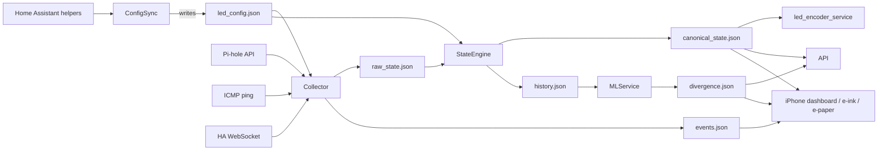

# Rehoboam Rack

Modern status wall that turns telemetry from Home Assistant, Pi-hole, and Jetson-hosted agents into a 16-LED panel, dashboards, and e-ink snapshots. This repo contains the full stack: firmware-friendly encoders, API, ML divergence scoring, and display clients.

Key design docs live in [`ARCHITECTURE.md`](ARCHITECTURE.md) and [`SERVICES_AND_AGENTS.md`](SERVICES_AND_AGENTS.md). This README summarizes the operational view.

## System Overview

```
Home Assistant + Pi-hole -> config_sync_service -> led_config.json
                               |
collector_service -> raw_state.json -> state_engine_service -> canonical_state.json
                                                            |-> history.json -> ml_service -> divergence.json
                                                            |-> led_encoder_service -> Teensy
                                                            |-> api_service -> dashboards/e-ink
```

Shared artifacts live under `./data` (config, state, history, divergence, service health, HA events).

## How the Pieces Fit Together

| Phase | Responsible Service(s) | Inputs | Output Artifact | Notes |
| ----- | ---------------------- | ------ | ----------------| ----- |
| 1. Configuration | `config_sync_service` | Home Assistant helper entities (`input_text.*`, `input_select.*`) | `data/led_config.json` | Cursor-friendly JSON describing each LED slot (name, IP, HA availability entity, event entities, type). |
| 2. Telemetry & Events | `collector_service` | `led_config.json`, ICMP ping, Pi-hole HTTP API, Home Assistant WebSocket/MQTT | `data/raw_state.json`, `data/events.json` | Each poll window records reachability, latency, HA availability, Pi-hole stats, plus a normalized stream of Home Assistant events for downstream visualizations. |
| 3. Canonical State | `state_engine_service` | `led_config.json`, `raw_state.json` | `data/canonical_state.json`, `data/history.json` | Health rules (`OK/WARNING/ERROR/OFFLINE`) and activity levels (`0.0–1.0`) are computed per LED. Every snapshot is appended to a rolling history used by ML, displays, and dashboards. |
| 4. Divergence / Analytics | `ml_service` | `history.json` | `data/divergence.json` | A simple z-score model compares the latest activity against rolling baselines (e.g., active LEDs, average activity, error count) and emits a score + level (`normal`, `caution`, `divergent`). Replaceable with more sophisticated models later. |
| 5. Distribution | `led_encoder_service`, `api_service`, `display_clients/*`, `epaper/` | `canonical_state.json`, `divergence.json`, `events.json`, `history.json` | Teensy LED frames (`{i,h,a,t}`), REST API responses (`/status`, `/config`, `/history`, `/health`, `/divergence`), iPhone dashboard, e-ink/e-paper scenes. |

**Why this shape?**

- Shared JSON artifacts keep the system debuggable. You can open any file under `data/` and immediately see what each service produced.  
- Every step is intentionally idempotent: services reread their inputs each loop and rewrite outputs atomically, so crashes or reboots don’t corrupt downstream consumers.  
- Heartbeats (`service_health.json`) mean the API and dashboards always know which agents are healthy.  
- The design mirrors well-known home automations stacks (e.g., [Home Assistant + ESPHome](https://www.home-assistant.io/), [Pi-hole dashboards](https://github.com/pi-hole/AdminLTE)) where helpers define config, collectors gather telemetry, and renderers subscribe to a canonical feed.

### Example Data Flow (Step-by-Step)

1. **Configuration authoring:**  
   Home Assistant helpers (input_text/input_select) → `config_sync_service` → `data/led_config.json`

2. **Telemetry & events:**  
   `config_sync_service` output + Pi-hole API + ping + HA WebSocket → `collector_service` → `data/raw_state.json` + `data/events.json`

3. **State derivation:**  
   `state_engine_service` reads `led_config.json` + `raw_state.json`, applies health/activity rules → `data/canonical_state.json` and appends to `data/history.json`

4. **Analytics:**  
   `ml_service` consumes `history.json`, computes divergence → `data/divergence.json`

5. **Distribution:**  
   - `led_encoder_service` converts `canonical_state.json` into `{i,h,a,t}` frames → Teensy/LED panel  
   - `api_service` serves `/status`, `/config`, `/history`, `/health`, `/divergence`  
   - Dashboards/e-paper scenes pull from `canonical_state.json`, `divergence.json`, `events.json`



To debug, inspect artifacts in this order: `led_config.json` → `raw_state.json` → `canonical_state.json` → `divergence.json`. Each service README describes the exact schema.

### Everyday Examples

1. **Turn on a lamp:** Home Assistant logs the action, the collector sees the event and pings the lamp’s bridge, the state engine marks the lamp LED as healthy/active, and every UI updates within a second. If pings fail, the LED goes red and `/status` reflects the failure.
2. **DNS spike:** Pi-hole reports QPS and block ratio; when traffic jumps, the state engine keeps the Pi-hole LED pulsing faster while the divergence score climbs. Dashboards and e-paper scenes pull the same numbers and can show “Pi-hole traffic high, blocked 32%”.
3. **Automation triggers a blind:** HA sends a `state_changed` event, the collector records “Blind → 50% (Sunrise automation)”, the activity log scene lists it, and the LED briefly animates to show motion.

The key idea: all displays, dashboards, and scripts read the same JSON files, so anyone can understand or debug what’s happening without digging into the code.

## Quick Start (Developer)

```bash
# clone + venv
git clone https://github.com/griffingilreath/rehoboam.git
cd rehoboam
python -m venv .venv && source .venv/bin/activate

# install deps
pip install -r jetson/requirements.txt

# copy sample configs
for svc in config_sync_service collector_service state_engine_service led_encoder_service api_service ml_service; do
  cp jetson/$svc/config.example.yaml jetson/$svc/config.yaml
done

# seed data dir for local testing
mkdir -p data && cp samples/led_config.json data/led_config.json  # optional
```

You can now run the pipeline locally (`python jetson/.../main.py --once`) or enable the provided systemd units once configs are filled out.

## Repository Layout

| Path | Purpose |
| --- | --- |
| `jetson/config_sync_service/` | Pull LED metadata from Home Assistant helpers. |
| `jetson/collector_service/` | Ping devices, gather Pi-hole stats, listen to HA events. |
| `jetson/state_engine_service/` | Convert raw metrics into canonical per-LED state + history. |
| `jetson/led_encoder_service/` | Stream compact frames over serial to the Teensy. |
| `jetson/api_service/` | FastAPI server exposing `/status`, `/config`, `/history`, `/health`, `/info`. |
| `jetson/ml_service/` | Simple divergence scorer (z-score baseline) that writes `divergence.json`. |
| `display_clients/iphone_dashboard/` | Static PWA dashboard for iPhone behind the two-way mirror. |
| `display_clients/eink_client/` | Script that renders grayscale PNGs for e-ink panels. |
| `epaper/` | Modular e-paper scene runner (CLI + config-driven service). |
| `jetson/common/` | Shared utilities (currently heartbeat tracker). |

## Prerequisites

- Jetson Nano (or any Linux host) with Python 3.9+
- [Home Assistant](https://www.home-assistant.io/) + MQTT (for helper entities and events)
- [Pi-hole](https://github.com/pi-hole/AdminLTE#http-api) HTTP API access
- Teensy (Arduino) connected via USB for the LED panel
- Optional: e-ink panel hardware, iPhone kiosk device

Install shared dependencies once:

```bash
python -m venv .venv && source .venv/bin/activate
pip install -r jetson/requirements.txt
```

Service-specific dependencies are documented in each directory (e.g., `display_clients/eink_client/requirements.txt`).
If you plan to prototype the e-paper scenes, install the Pillow/IT8951 extras:

```bash
pip install -r epaper/requirements.txt
```

## Configuration & Data Directory

1. Create a writable data directory (default `./data`).
2. Copy each service's `config.example.yaml` → `config.yaml` and edit:
   - Home Assistant URLs/tokens
   - Serial device path and baud rate
   - API host/port, CORS origins
   - ML/History retention thresholds
3. Ensure `data/` is shared by all services so files like `led_config.json`, `raw_state.json`, `canonical_state.json`, `history.json`, `divergence.json`, and `service_health.json` stay in sync.

## Running the Core Services

Typical order (each in its own process/systemd unit):

```bash
python jetson/config_sync_service/main.py --config jetson/config_sync_service/config.yaml
python jetson/collector_service/main.py --config jetson/collector_service/config.yaml
python jetson/state_engine_service/main.py --config jetson/state_engine_service/config.yaml
python jetson/led_encoder_service/main.py --config jetson/led_encoder_service/config.yaml
python jetson/api_service/main.py --config jetson/api_service/config.yaml
python jetson/ml_service/main.py --config jetson/ml_service/config.yaml  # optional but enables divergence visuals
```

All services write heartbeats into `data/service_health.json`. The API reads that file for `/health`, so as long as every process points at the same `data_dir`, the dashboard can show live service status.

### systemd Templates

Sample units live in [`systemd/`](systemd/README.md). After creating `/etc/rehoboam.env` with the appropriate paths (`REHOBOAM_HOME`, `REHOBOAM_VENV`, `REHOBOAM_DATA`), copy the `.service` files into `/etc/systemd/system/`, run `sudo systemctl daemon-reload`, and `enable --now` whichever agents you need. This keeps the stack resilient across reboots and ensures `service_health.json` stays fresh.

### Teensy Firmware

The host-side encoder is ready; pair it with a Teensy sketch that parses frames `{i,h,a,t}` and drives the 16 Neopixels (see `SERVICES_AND_AGENTS.md` §7 for guidance).

### Display Clients

- **iPhone dashboard:** serve `display_clients/iphone_dashboard` (e.g., `python -m http.server 8080 --directory display_clients/iphone_dashboard`) and point Safari at it; override API base via `localStorage.setItem('rehoboam_api', 'http://jetson-rack.local:8000')` if needed.
- **E-ink render:** run `python display_clients/eink_client/render.py --api http://jetson-rack.local:8000 --output /tmp/frame.png` on a timer and push the PNG to your panel.
- **E-paper scenes:** the new `epaper/` module can render animated scenes (standby type-in, activity log, Pi-hole stats, divergence gauge, etc.) either to a fake backend (PNG dumps) or real IT8951 hardware. Run ad hoc via `python -m epaper.cli.main --backend fake --scene divergence` or use the config-driven runner `python -m epaper.service.main --config epaper/config.yaml`. Wiring/build instructions and partial-refresh tips for the IT8951 panel live in `epaper/README.md`, referencing the official Waveshare examples and Greg Meyer’s Python driver[^it8951].

## Tests & CI

- Unit tests live under `tests/` (currently covering the ML divergence model). Run them with:
  ```bash
  source .venv/bin/activate
  python -m unittest discover -s tests -v
  ```
- GitHub Actions workflow [`.github/workflows/ci.yml`](.github/workflows/ci.yml) provisions a venv, installs `jetson/requirements.txt`, and executes the test suite on pushes/PRs. Add more suites (lint, integration) by dropping additional YAML files next to it.

## Observability & Logs

- Each service uses Python's `logging`; set `logging.level` in config or pass `--log-level`.
- `service_health.json` entries show `status`, `updated_at`, host, pid, and optional error messages—surface them via API `/health` or inspect directly.
- `events.json` captures normalized Home Assistant events (via `collector_service`) for the e-paper activity feed.
- Files are written atomically (`.tmp` + rename) to keep downstream readers safe.

## Documentation Index

- [`ARCHITECTURE.md`](ARCHITECTURE.md): hardware/network overview, data flow, entity modeling.
- [`SERVICES_AND_AGENTS.md`](SERVICES_AND_AGENTS.md): in-depth specs for every agent, firmware responsibilities, client layouts.
- [`docs/home_assistant.md`](docs/home_assistant.md): helper definitions + Lovelace layout for configuring rack ports from HA.
- Service-specific READMEs under `jetson/*/`, `display_clients/*/`, and `epaper/` cover configuration, operations, and troubleshooting.

## Future Enhancements

- Richer ML/anomaly detection (swap `DivergenceModel` with more advanced time-series models).
- SNMP/managed switch telemetry in `collector_service`.
- WebSocket push channel in `api_service` + dashboard for smoother updates.
- Teensy firmware implementation sharing the same repo (e.g., under `firmware/`).
- E-paper scene scheduler + control surface (e.g., select scenes via API, rotation by time of day).
- Broader automated testing + schema validators for the shared JSON contracts.

Pull requests or ideas should reference the architecture docs to keep the system coherent.

[^it8951]: See [Waveshare’s IT8951 reference repo](https://github.com/waveshare/IT8951) for waveform timings/USB tooling and [`GregDMeyer/IT8951`](https://github.com/GregDMeyer/IT8951) for the Python driver used by the SPI backend.
